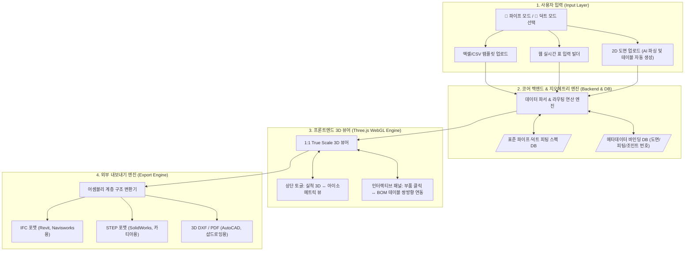
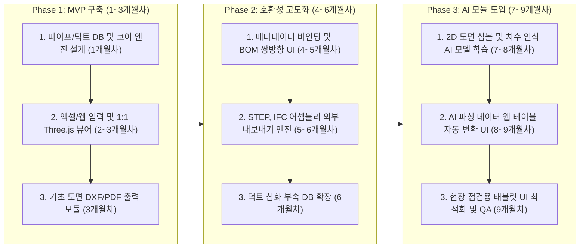

# 🚀 [마스터 실행 계획서] 스마트 배관·덕트 3D 자동 생성 및 인터랙티브 도면 솔루션

---

## 1. 프로젝트 개요 및 비전

### 1.1 서비스 비전
본 서비스는 설계 데이터(엑셀, 웹 입력, 2D 도면)를 바탕으로 **파이프(배관) 및 덕트(HVAC) 설비를 1:1 실척 3D 모델 및 아이소메트릭(ISO) 도면으로 자동 생성**하는 웹 기반 엔지니어링 SaaS 솔루션입니다. 사용자는 직관적인 웹 뷰어에서 도면번호, 피팅번호, 조인트(용접) 번호를 실시간으로 추적·관리할 수 있으며, 생성된 완성물을 외부 전문 CAD/BIM 툴로 추출하여 완벽하게 2차 수정할 수 있는 차세대 스마트 워크플로우를 제공합니다.

### 1.2 5대 핵심 차별화 가치
1. **파이프 & 덕트 통합 지원**: 원형 배관뿐만 아니라 사각/스파이럴 덕트, 트랜지션, 댐퍼까지 완벽 수용
2. **초고속 데이터 입력 체계**: 실무 최적화 엑셀(CSV) 일괄 업로드 및 웹 실시간 빌더 지원 (추후 AI 도면 인식 연동)
3. **1:1 True Scale (실척) 보장**: 실제 치수 기반 3D 생성 및 `[실척 모드 ↔ 도면 가독성 모드]` 전환 토글 지원
4. **쌍방향 메타데이터 인터랙션**: 3D 부품 클릭 시 조인트/피팅 번호 즉시 하이라이트 및 BOM 테이블 연동
5. **외부 3D 툴 완벽 호환**: 개별 부품 수정이 가능한 어셈블리 계층 구조의 **STEP(기계 CAD), IFC(BIM), 3D DXF** 변환 내보내기

---

## 2. 전체 시스템 아키텍처

---

## 3. 기능 구현 상세 스펙

### 3.1 🚰 파이프 vs 💨 덕트 모드별 데이터 파서 (Data Parser)
* **파이프 모드**: 
  * 호칭경(예: 100A, 4인치) 및 스케줄(Sch40 등) 입력 시, 표준 DB를 참조하여 직관, 엘보우, 티, 밸브의 정확한 외경(OD) 및 곡률반경을 계산하여 결합.
* **덕트 모드**:
  * 사각(W × H), 원형(Ø) 단면 형태 선택 지원. 
  * 사각 ↔ 원형 간 연결 시 자동으로 커스텀 곡면 트랜지션(호퍼) 지오메트리를 생성하며, 풍량조절댐퍼(VD), 방화댐퍼(FD) 등의 피팅을 자동 삽입.

### 3.2 3D 뷰어 메타데이터 인터랙션 및 검색 기능
* **Three.js `userData` 바인딩**: 생성되는 모든 파이프/덕트 메쉬 내부에 고유 속성(도면번호, 피팅번호, 조인트번호, 스펙)을 1:1 삽입.
* **호버 & 클릭 동작**: 객체 호버 시 퀵 툴팁 표기, 클릭 시 우측 전체 상세 속성 패널 오픈.
* **쌍방향 하이라이트**: 하단 BOM(자재명세서) 테이블의 조인트/부품 클릭 시, 3D 뷰어 카메라가 해당 위치로 자동 줌인(Zoom-in) 및 형광색 점멸.
* **통합 검색창**: 상단 검색창에 특정 조인트 번호(예: `JNT-005`) 검색 시, 나머지 배관은 투명도 20%로 반투명 처리되고 대상만 하이라이트.

### 3.3 뷰 모드 토글 (실척 ↔ 도면 가독성 모드)
* **실척 모드 (True Scale)**: 1 Unit = 1 mm 절대 좌표를 적용하여 간섭 체크(Clash Detection) 및 정확한 체적/길이 산출을 위한 1:1 모델링 뷰.
* **도면 모드 (Non-Scale ISO)**: 버튼 클릭 시 긴 직관은 중간 파단선 효과와 함께 시각적으로 단축되고, 밸브와 피팅 밀집 구역은 간격이 확장되어 2D 인쇄 및 도면화에 최적화된 화면으로 즉시 변환.

---

## 4. 권장 기술 스택

| 구분 | 추천 기술 | 주요 역할 및 선택 이유 |
| :--- | :--- | :--- |
| **프론트엔드** | **Next.js (React)**, TailwindCSS | 사용자 웹 애플리케이션 구축, 빠르고 유연한 인터랙티브 UI 패널 제공 |
| **3D 그래픽 엔진** | **Three.js** (또는 React Three Fiber) | 웹 브라우저 기반 고성능 3D/ISO 렌더링, 레이캐스팅 및 3D 텍스트 태그 부착(`CSS2DRenderer`) |
| **백엔드** | **Python (FastAPI)** | 빠르고 비동기적인 연산 엔진, Python 생태계의 다양한 CAD/BIM 라이브러리와 100% 네이티브 호환 |
| **CAD/BIM 내보내기** | **PythonOCC**, **IfcOpenShell**, **ezdxf** | 외부 툴에서 부품별 수정이 가능한 **STEP**(PythonOCC), 메타데이터 포함 **IFC**(IfcOpenShell), **DXF**(ezdxf) 파일 자동 생성 |
| **AI 도면 인식 (추후)**| **YOLOv8**, OpenCV, Tesseract OCR | 2D 도면 업로드 시 배관 심볼, 밸브, 텍스트(치수) 객체 탐지 및 테이블 데이터 자동 변환 |

---

## 5. 단계별 개발 및 실행 로드맵

### 🔹 [Phase 1] MVP (최소 기능 제품) 구축 (1~3개월차)
* **목표**: 엑셀 업로드 및 웹 테이블 입력을 통해 1:1 실척 파이프/사각 덕트 3D 모델과 ISO 도면을 즉시 생성·출력하는 핵심 동작 엔진 완성.
* **주요 마일스톤**:
  * 파이프(Sch40 등) 및 사각 덕트 표준 지오메트리 백엔드 라이브러리 구축
  * 엑셀 템플릿 파서 및 Three.js 기반 3D 실시간 뷰어 구현
  * `ezdxf`를 이용한 2D 아이소메트릭 DXF 및 PDF 다운로드 기능 구축

### 🔹 [Phase 2] 메타데이터 인터랙션 & 외부 호환성 고도화 (4~6개월차)
* **목표**: 3D 뷰어 내 조인트/피팅 번호 검색·추적 기능과 외부 3D 툴(Revit, SolidWorks)에서 부분 수정 가능한 파일 변환 엔진 완성.
* **주요 마일스톤**:
  * Three.js 뷰어 ↔ BOM 테이블 간 쌍방향 하이라이트 및 호버 툴팁 기능 완성
  * `PythonOCC` 및 `IfcOpenShell` 기반 어셈블리 계층 구조 STEP, IFC 내보내기 모듈 연동
  * 원형 덕트, 호퍼(트랜지션), 댐퍼 등 복합 부속 DB 확장

### 🔹 [Phase 3] AI 2D 도면 인식 및 현장 최적화 (7~9개월차)
* **목표**: 기존 2D CAD/PDF 도면을 AI로 인식하여 데이터 입력 과정을 전면 자동화하고, 시공 현장 점검용 태블릿 UI 지원.
* **주요 마일스톤**:
  * YOLOv8 및 OCR 기반 2D 배관/덕트 도면 심볼 탐지 및 추출 알고리즘 개발
  * AI가 추출한 정보를 1단계 웹 테이블 양식으로 자동 렌더링 (사용자 수정/검수 UI 제공)
  * 현장 시공 및 품질 검수자(태블릿 환경)를 위한 조인트 검수 완료 체크리스트 기능 추가

---

## 6. 성공을 위한 핵심 제언 (결론)

본 계획서의 아키텍처는 **"1:1 실척 데이터 모델링의 정확성"**, **"조인트/피팅 메타데이터의 현장 추적성"**, **"전문 3D 툴과의 완벽한 호환성"**이라는 3대 핵심 기둥을 기반으로 설계되었습니다.

초기에 개발 리스크가 높은 AI 도면 인식(Phase 3)에 매달리기보다, 실무 엔지니어들이 즉시 열광할 수 있는 **[엑셀 드래그 앤 드롭 ➔ 실척 3D/ISO 생성 ➔ 조인트 메타데이터 추적 ➔ STEP/IFC 내보내기] (Phase 1 & 2)** 워크플로우를 최우선으로 확보하십시오. 이 기반이 탄탄하게 완성되면, 추후 AI 모듈을 부착했을 때 업계를 선도하는 가장 강력하고 혁신적인 배관·덕트 자동화 솔루션으로 자리매김할 것입니다.
